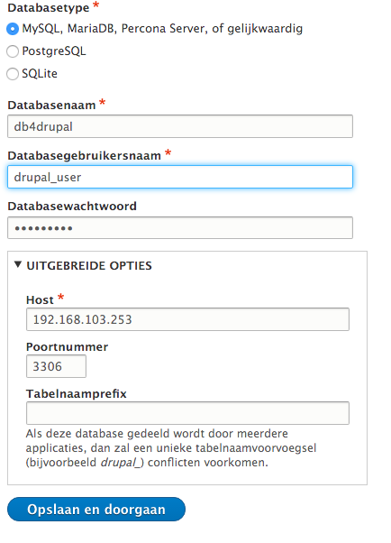

## Docker

Below we provide a step by step guide on how to set-up a working Drupal environment deployed in two Docker containers, one for Drupal and one for MySQL.

Create a new cloud space, suggested name is 'Drupal'


* Add a new virtual machine to the cloud space, suggested name 'DM-Host', this virtual machine will be used to host docker machine.

* Add following port forwardings for this virtual machine:
 * 7122:22
 * 2376:2376
4. Open a SSH session into the new virtual machine:

	```shell
	ssh cloudscalers@<ip-address> -p 7122
	```

* If not already the case, add the hostname of the virtual machine (typically "vm-three\_digit\_number") in `/ets/hosts` to the first line:

	```shell
	sudo vi /etc/hosts
	127.0.0.1 localhost virtual_machine_name
	```

* Create new user that is member of the sudo group in order to allow the new user to use sudo commands

	```shell
	sudo adduser new_user_name
	sudo adduser new_user_name sudo
	```
	
* Logout and login again as new_user_name

* Add your public key (`cat ~/.shh/id_rsa.pub`) to the remote `authorized_keys`:

	```shell
	mkdir ~/.ssh
	vi ~/.ssh/authorized_keys
	```

* In order to meet [the prerequisites of Docker](https://docs.docker.com/engine/installation/linux/ubuntulinux/):

	```shell
	sudo apt-get update
	sudo apt-get install linux-image-extra-$(uname -r)
	```
	
* Back from your local machine, install a docker machine (“dm4drupal") on the new virtual machine:

	```shell
	docker-machine -D create -d generic --generic-ip-address 85.255.197.125 --generic-ssh-port 7122 --	generic-ssh-user yves dm4drupal
	```

* Check that docker machine got installe

	```shell
	docker-machine ls
	```
	
* Make the newly creates docker machine current:
	```shell
	eval $(docker-machine env docker-machine4drupal)
	docker-machine ls => a star will appear next to docker-machine4drupal
	```
	
* Let’s first create a container for mysql fron [Docker Hub] (https://hub.docker.com/r/mysql/):
	
	```shell
	docker run --name mysql-on-dm-host -p 3306:3306 -e MYSQL_ROOT_PASSWORD=yourMySQLpassword -d mysql/mysql-server:5.7 
	```
	
	(-p binds container port to host port)
	
	(-e is for setting environment variables)
	
	(-d is running the container in background and printing the container ID)
	
	
* Start a shell in the running container:

	```shell
	docker exec -it mysql-on-dm-host bash
	```

* Start mysql for adding a user:

	```shell
	mysql -uroot -p"yourMySQLpassword"
	create user 'drupal_user' identified by 'yourMySQLpassword';
	grant all privileges on * . * to ‘drupal_user’;
	flush privileges;
	```

* Or - alternatevilly - do the same from within another container based on the mysql image:

	```shell
	docker run -it --link mysql-on-default:mysql --rm mysql/mysql-server:5.7 sh -c 'exec mysql -h"$MYSQL_PORT_3306_TCP_ADDR" -P"$MYSQL_PORT_3306_TCP_PORT" -uroot -p"$MYSQL_ENV_MYSQL_ROOT_PASSWORD"'
	```
	
	(-rm automatically removes the container when it exists)
	
	(--link= adds a link to another container)
	
	
* Now let start another container for [Drupal] (https://hub.docker.com/_/drupal/):

	```shell
	docker run --name drupal-on-dm-host -p 9080:80 --link mysql-on-dm-host:myysql -d drupal
	```
	
* Check the result:

	```shell
	docker ps 
	CONTAINER ID        IMAGE                    COMMAND                  CREATED             				STATUS              		PORTS                               				NAMES
4e08530e6b4c        drupal                   "apache2-foreground"     2 minutes ago       			Up 2 minutes        	0.0.0.0:9080->80/tcp                			drupal-on-dm-host
6a4a070f2bab        mysql/mysql-server:5.7   "/entrypoint.sh mysql"   46 minutes ago     	Up 46 minutes       	0.0.0.0:3306->3306/tcp, 33060/tcp   	mysql-on-dm-host
```

* Add a port forwarding on order to access Drupal:

	
	
* Visit the Drupal installation page, running in the Docker container: http://\<public_id_address_cloud_space>:9080.
* Specify the user you created in MySQL and make sure to specify the private IP address of your virtual machine hosting the docker machine:

	
	
	


