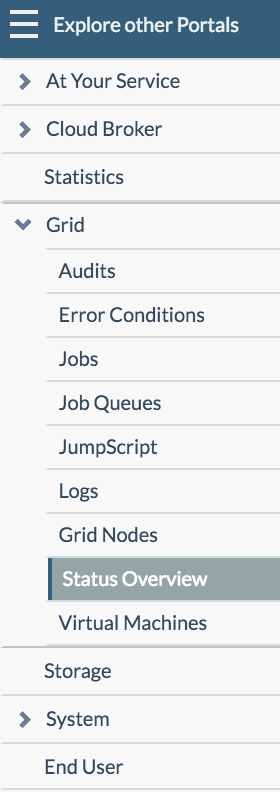

### Status Overview

On the **Status Overview** page you get an immediate view on the health of the system.

You can access the **Status Overview** page in two ways:

- By clicking the green/orange/red status dot in the top navigation bar:
	

	
- Via the left navigation bar, under **Grid Portal** click **Status Overview**:



Under the **Process Status** section you get an overview of the health based on the last health check. By clicking **Run Health Check** a new health check get scheduled for immediate starting.


Clicking the **Details** link brings you to a detailed status view for the selected node:

![[]](MonitoringStatusDetails.png)

Clicking **Run Health Check on Node** will schedule several health check jobs as you can verify on the **Jobs** page:

![[]](Jobs.png)

On the **Status Overview Details** page you can see more details by clicking the various section titles:

**AYS Process**

![[]](AYSProcess.png)

**Alba Module**

![[]](Alba.png)

**Arakoon Module**

![[]](Arakoon.png)

**Bandwidth Test**

![[]](Bandwith.png)

**CPU**

![[]](CPU.png)

**Disks**

![[]](Disks.png)

**JSAgent**

![[]](JSAgent.png)

**OVS Module**

![[]](OVSModule.png)

**OVS Services**

![[]](OVSServices.png)

**Orphanage**

Here you get an overview of all "orphane" virtual machines. Those vm's are marked as destroyed on the portal but still exist in reality on the physical node.

This is obviously unwanted, and as part of automatic healthchecks, "orphane" virtual machines will get removed.

In order to manually remove "orphane" virtual machines use the following commands at the command prompt:

````shell
disks="$(virsh dumpxml vm-8 | grep 'source file' | cut -d "'" -f 2)"
virsh destroy vm-8
rm $disks
rm -rf /mnt/vmstor/vm-8
````

![[]](Orphanage.png)

**Redis**

![[]](Redis.png)

**Workers**

![[]](Workers.png)

**StorageTest**

![[]](StorageTest.png)


 
