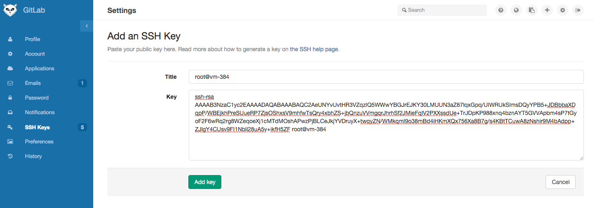

# Preparing for indirect access to ovc_git

## Getting access to AYDO

Your first step will be to make sure you have - and if not, request - access to this git repository:
`https://git.aydo.com/groups/openvcloudEnvironments/$name-of-your-env$`


## Configure your AYDO and GitHub accounts to use your SSH key for authentication

All the steps below should be executed from a physical or virtual machine running Ubuntu.

On that machine make sure to run all your commands with root privileges:
```
sudo -i
```

In order to check whether you already have existing SSH keys on the computer (running Linux) from which you want to connect to an OpenvCloud environment:
```
ls -al ~/.ssh
```

This will list the files in the hidden `.ssh` directory.

If you started with a *fresh* virtual machine running Ubuntu, you will get following output:
```
root@vm-384:~# ls -al ~/.ssh
total 8
drwx------ 2 root root 4096 Dec 22 14:56 .
drwx------ 3 root root 4096 Dec 22 15:02 ..
-rw------- 1 root root    0 Dec 22 14:56 authorized_keys
```

In that case, or in case you receive an error that `~/.ssh` doesn't exist, you will need to create your keys:
```
ssh-keygen -t rsa
```

This starts the key generation process. When you execute this command, the ssh-keygen utility prompts you to indicate where to store the key.

Press the ENTER key to accept the default location. The ssh-keygen utility prompts you for a passphrase.

Type in a passphrase. You can also hit the ENTER key to accept the default (no passphrase). However, this is not recommended.

After you confirm the passphrase, the system generates the key pair:
- Your private key is saved to the `id_rsa file` in the `.ssh` directory
- Your public key is saved to the `id_rsa.pub` file

Now add your SSH key to the ssh-agent, by first making sure ssh-agent is running, and then actually adding them:
```
eval $(ssh-agent)
ssh-add ~/.ssh/id_rsa
```

Display the generated public key, so you can easily copy it:
```
cat ~/.ssh/id_rsa.pub
```

Finally make sure that you public key is registered at AYDO and (optianally) GitHub, by copying the public key from `~/.ssh/id_rsa.pub` to AYDO and GitHub:
- For AYDO (GitLab): https://git.aydo.com/profile/keys
- And (optionally) for GitHub: https://github.com/settings/ssh

Below screenshot for AYDO:



Of course, in case you already have an existing public and private key pair that you would like to use to connect to AYDO (GitLab) and (optionally) GitHub, make sure that you register that one instead of creating a new one.


## Install and configure Git on your computer

```
sudo apt-get update
sudo apt-get install git
```

This will download and install git on your system...

Once installed, you need to do a few things so that the commit messages that will be generated for you will contain your correct information.

The easiest way of doing this is through the git config command. Specifically, you need to provide your name and email address because git embeds this information into each commit we do. We can go ahead and add this information by typing:
```
git config --global user.name "Your Name"
git config --global user.email "youremail@domain.com"
```

You can verify all of the configuration items that have been set by typing:
```
git config --list
```

```
user.name=Yves Kerwyn
user.email=yves.kerwyn@greenitglobe.com
```

This information is stored in the the configuration file for Git, which you can optionally edit:
```
vi ~/.gitconfig
```

```
[user]
	name = Yves Kerwyn
	email = yves.kerwyn@greenitglobe.com
```
