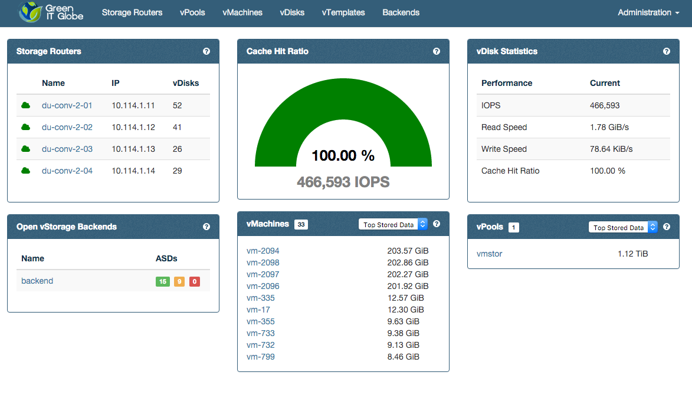

# Test script

This script is the actual stress tests.

It uses the AYS node created by the setup script to know about the environment.

From a well prepared computer, as documented [here](../../Sysadmin/preparing_for_indirect_access.md), before connecting to the docker container, let's make sure `ssh-agent` is running, and that your SSH keys are added:
```
ssh-add -l
```

If not, when getting the error `Could not open a connection to your authentication agent.`:
```
eval $(ssh-agent -s)
ssh-add $HOME/.ssh/id_rsa
```

Connect to the docker container, using the public IP address of your stress test cloud space, password is gig1234:
```
ssh root@192.168.28.51 -A -p 2201
```

To start the stress test, just execute the following command:   
```
cd /opt/code/git/0-complexity/ays_stresstest/scripts
jspython perf.py
```

When running the script for the first time it will take longer to execute, since it also mounts all virtual disks.

For best results you should run it twice.

While running use the `status.py`script in order to check wether it is actually still running on each node:
```
jspython ../status.py
```

If there is an error on the SSH connection then add the following command:
````
eval $(ssh-agent -s)
````

While running check the **Open vStorage Portal** for the actual performance.

In case of `du-conv-2` goto https://ovs-du-conv-2.demo.greenitglobe.com



# Test performed

Actually, the performance test scripts runs:
- All tests on each CPU node (stack) from the environment
- The scripts runs test in this order:
  - Initial write
  - Re-write
  - Read
  - Re-read
- File sizes is set to 1000M
- The tests use POSIX Threads, POSIX Async I/O, Direct I/O
- Each record size is set to 256k

Here is the command line executed:
```bash
iozone -i 0 -i 1 -R -s 1000M -I -k -l 5 -r 256k -t 3 -T -F ... -F ... -F ... -F ...
```

# Implementing new tests

The actual stress test is done with [iozone3](http://www.iozone.org/).  

If you want to create a new test, go the to [PerfTestTools.py]( https://github.com/jumpscale7/jumpscale_core7/blob/master/lib/JumpScale/lib/perftesttools/PerfTestTools.py) and implement a new method in this class.

Then call the method from the [perf.py script](https://git.aydo.com/0-complexity/ays_stresstest/blob/master/scripts/perf.py)
